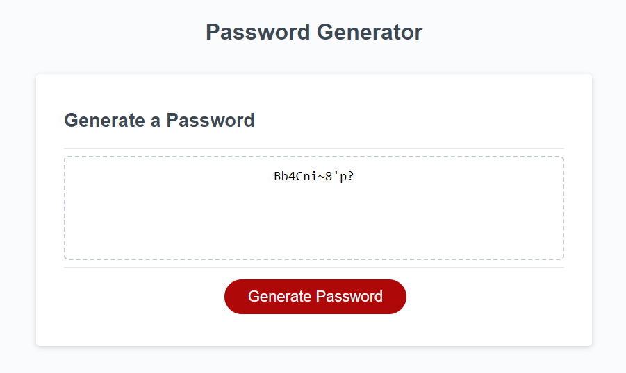

# Random Password Generator

# Introduction

During this assignment we were provided with Starter Code, which included a number of arrays of different types of characters that would be used for the generation of a random password, to the users required length. 

I have maintained the ability to run this code in either Production P or Testing T environments, the Testing Environment outputs more data to the console logging which has proved very helpful for debugging. 

# To view this project

Please visit the Git Page: <a href="https://ucstuart.github.io/UoBPasswordGenerator/"> Here </a>

The REPO can also be found: <a href="https://github.com/ucstuart/UoBPasswordGenerator"> Here </a>

# Screenshot

A screenshot of the final screen of the project is below, showing a random generated password:

